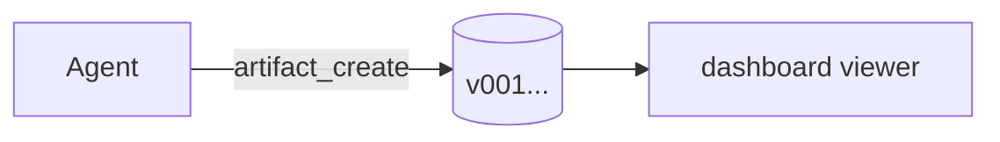
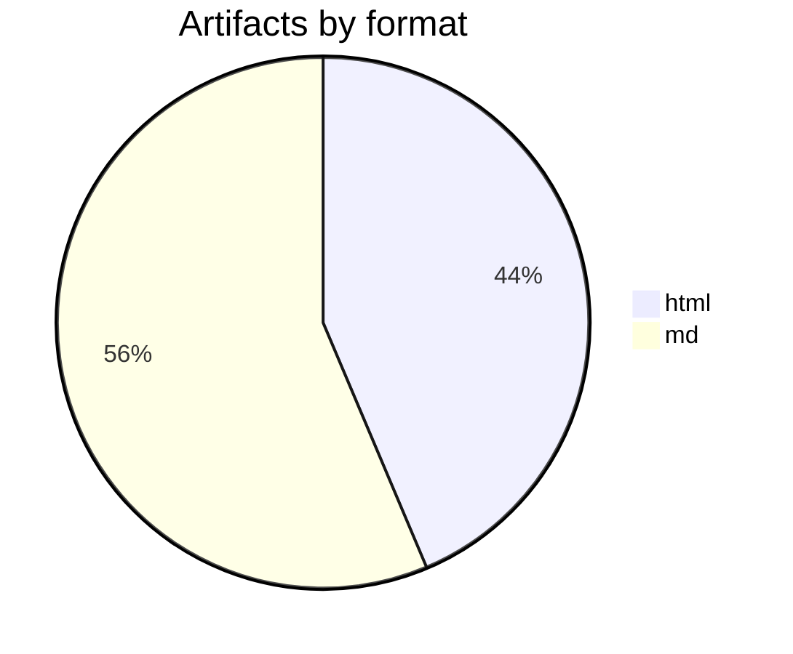

# Authoring markdown/mdx artifacts — complete reference

You (the agent) write a document. The artifact dashboard renders it in a
built-in viewer. You never generate HTML for documents, never ship a render
setup, never write files by hand — you call the tools (see SKILL.md) and the
viewer does the rest.

**Before writing mdx, call `artifact_capabilities`** (omp tool) or
`artifact capabilities --json` (CLI): same data as this page, always in sync
with the installed version.

## The contract (hard rules)

1. **Component props must be literals.** Strings `"…"`, numbers, booleans,
   and inline JSON arrays/objects. The viewer executes no code, so
   `data={sales}` (a variable reference) renders as a placeholder box, never
   a chart. **Inline your data**: `data={[{ name: "Q1", sales: 12 }]}`.
2. **Components sit on their own lines** (block-level, may be indented).
   Inline JSX in the middle of a paragraph is not a component call.
3. **No `import`/`export` statements** — they are useless here and hidden
   from the reader. Same for `{/* expression comments */}`.
4. **Unknown components never crash** — they render as a visible placeholder
   `⟨Tag⟩` so readers see something belongs there. Don't invent components:
   use the built-ins below or plain markdown.
5. **Children of `Callout`/`Stats`/`Section` are markdown** — bold, lists, links, even
   nested components work inside them.
6. Lowercase HTML tags (`<details>`, `<b>`) pass through as normal markdown
   HTML; capitalized tags are components.

## Relevance filter — apply BEFORE any visual

Components and diagrams are **information tools, not decoration**. The
default document is prose; a visual must do work text cannot.

**A diagram earns its place only when it shows structure**: 3+ interacting
steps or actors, architecture with relations, state transitions, branching
decisions. Otherwise skip it: linear steps → numbered list, comparison →
table, everything else → prose.

**A chart requires REAL data** — numbers you actually have from the
conversation, the repo, or the task. **Never invent plausible numbers to
justify a chart.** No real data → no chart.

Hard limits: **one diagram per document** (unless the document is itself
architecture/flow documentation), and if the surrounding text has to explain
the visual, the visual should not exist.

| Need | Format |
| --- | --- |
| Notes, reports, specs, any prose | `md` |
| Same + a visual that passed the filter above | `mdx` |
| Long doc needing quick navigation | `md` or `mdx` — 3+ `##` headings auto-build the Secciones sidebar |
| Truly interactive / self-contained page | `html` (last resort) |

## Sections index (md and mdx, automatic)

Every `##` / `###` heading gets an anchor id (accents stripped:
`Qué es` → `#que-es`). With **3+ headings** the viewer shows a
**Secciones sidebar** (sticky + scroll-spy on desktop, stacked on
mobile) with a **search box filtering entries** — everything authors keep
adding via `##` appears there, so readers jump around long documents.
Short docs keep the single-column
look. One `#` title per document; `##` for sections, `###` for
subsections.

## Sibling files & sub-routes — the folder standard

An artifact is a **folder**. Files next to `index.mdx` are first-class:

```
docs/artifacts/un-artifact/
├── index.mdx        # entry (versioned via artifact_create)
├── asset.png        # 
├── logo.svg         # inline by relative path
├── clip.mp4         # <Video src="clip.mp4" />
├── nota.mp3         # <Audio src="nota.mp3" />
├── other.html       # sub-route; embed with <Webframe src="other.html" />
└── other.md         # [notes](other.md) → renders as a viewer sub-route
```

- Reference siblings by **relative path only** — the viewer URL makes them
  resolve. Never absolute/external URLs for local files.
- Agents attach bytes with `artifact_asset` (name may be a subpath like
  `shots/01.png`; bytes live in the store, served at
  `/artifacts/<slug>/<name>`). You may also drop or symlink a folder into
  `docs/artifacts/<slug>/` — the daemon serves whatever it finds.
- `Webframe` (web viewer component): props `src` (required, relative),
  `title?`, `height?` (160-720, default 360). Browser-chrome embed of a
  sibling HTML — ideal for wireframes and mock pages inside a document.

## Frontmatter (both md and mdx)

```yaml
---
title: Release Notes Q3        # sidebar label; fallback: first # heading
type: study                    # generic (default) | study | wireframe (sidebar badge)
---
```

## Built-in components

### `Chart` — real chart (rendered with recharts)

```mdx
<Chart
  type="bar"
  title="Revenue by quarter (k USD)"
  data={[
    { name: "Q1", mrr: 12.0, churn: 2.1 },
    { name: "Q2", mrr: 12.8, churn: 1.9 },
    { name: "Q3", mrr: 14.9, churn: 1.4 },
  ]}
  series={["mrr", "churn"]}
/>
```

| Prop | Required | Type | Default | Notes |
| --- | --- | --- | --- | --- |
| `data` | yes | array of objects | — | one object per point; one string key (x axis) + numeric keys |
| `type` | no | `"bar" \| "line" \| "area" \| "pie"` | `"bar"` | |
| `x` | no | string | `"name"` | which key is the category axis |
| `series` | no | array of strings | all numeric keys (max 4) | which keys to plot; pie uses the first |
| `title` | no | string | — | small caption above the chart |
| `height` | no | number | `240` | px, clamped to 160–480 |

- Charts are **static renders** (no hover tooltips) and follow the dashboard
  theme automatically.
- Pie: values come from `series[0]` (or the first numeric key), labels from `x`.

### `Stats` + `Stat` — KPI grid

```mdx
<Stats>
  <Stat value="14.9k" label="MRR" delta="+24%" />
  <Stat value="1.4%" label="Churn" delta="-0.5pp" />
  <Stat value="72" label="Sessions" />
</Stats>
```

| Component | Prop | Required | Notes |
| --- | --- | --- | --- |
| `Stat` | `value` | yes | main figure (string) |
| `Stat` | `label` | no | small uppercase caption |
| `Stat` | `delta` | no | starts with `+` → green, `-` → red |
| `Stats` | children | yes | the `<Stat />` cells; responsive grid |

### `Callout` — highlighted note

```mdx
<Callout type="warning" title="Props must be literals">
  `data={sales}` does **not** work — write `data={[{ name: "Q1", sales: 12 }]}`.
</Callout>
```

| Prop | Required | Notes |
| --- | --- | --- |
| `type` | no | `info` (default) \| `warning` \| `success` \| `danger` — picks color |
| `title` | no | bold heading |
| children | no | **markdown body** (bold, lists, links, code) |

### `Section` — named card section (joins the Secciones index)

```mdx
<Section title="Cierre de jornada" subtitle="Qué tiene que pasar en la operación">
  Prose, lists, even `<Chart />` or `<Svg />` inside.
</Section>
```

| Prop | Required | Notes |
| --- | --- | --- |
| `title` | yes | card heading; becomes the `#anchor` (accents stripped) |
| `id` | no | custom anchor, e.g. `id="cierre"` → `#cierre` |
| `subtitle` | no | muted line under the heading |
| children | no | **markdown body** |

### `Svg` — declarative vector graphic (no hand-written markup)

Describe boxes, circles, arrows, lines and texts as literal data:

```mdx
<Svg
  title="Vende · Cobra · Controla"
  shapes={[
    { type: "box", x: 10, y: 50, w: 150, h: 70, label: "Vende", sub: "en ruta", color: "blue" },
    { type: "arrow", x1: 160, y1: 85, x2: 210, y2: 85 },
    { type: "box", x: 210, y: 50, w: 150, h: 70, label: "Cobra", sub: "por cliente", color: "green" },
  ]}
/>
```

| `type` | Coords | Extras |
| --- | --- | --- |
| `box` | `x`, `y`, `w`, `h` | `label?`, `sub?`, `color?` |
| `circle` | `cx`, `cy`, `r` | `label?`, `color?` |
| `arrow` | `x1`, `y1`, `x2`, `y2` | `label?`, `dashed?` |
| `line` | `x1`, `y1`, `x2`, `y2` | `label?`, `dashed?` (no arrowhead) |
| `text` | `x`, `y`, `text` | `size?` (9–28), `anchor?` (`middle`/`start`/`end`) |

Canvas `width?` (240–860, default 640), `height?` (120–520, default
220), `title?`. Colors: `blue` (default), `green`, `yellow`, `red`,
`purple`, `teal`, `gray`. Max 40 shapes. Same relevance filter as
charts: real structure from the document, never invented content.

### `Video` / `Audio` — native playback (sibling file or https URL)

```mdx
<Video src="clip.mp4" title="Demo de la ruta" poster="thumb.png" />
<Audio src="nota.mp3" title="Resumen en audio" />
```

| Prop | Required | Notes |
| --- | --- | --- |
| `src` | yes | sibling path (`clip.mp4`) or `https://` URL; `javascript:`/`data:`/`blob:`, `..` and absolute paths render as a placeholder |
| `title` | no | caption under (`Video`) / next to (`Audio`) the player |
| `poster` | no | `Video` only — cover image, same src rules as `src` |
| `controls` | no | default `true` |
| `autoplay`, `loop`, `muted` | no | default `false` (`autoplay` plays muted inline) |

Video: mp4, webm, ogv, mov, mkv. Audio: mp3, wav, ogg, m4a, aac, flac, opus.
Images stay plain markdown (`` or ``); links too
(`[text](other.md)`, `[text](https://…)`). `autoplay` always plays muted (browser policy).

## Diagrams — mermaid fences (md and mdx)

Any fenced block tagged `mermaid` renders as a diagram. No component, no props:

````mdx

````

Supported: flowchart, sequence, class, state, ER, gantt, pie, journey,
mindmap, gitGraph… (whatever the installed mermaid supports). Rendered
client-side; if scripts are unavailable the raw source stays visible.
If a diagram passed the relevance filter, render it as a mermaid fence —
never as ASCII art.

Pie labels **must be quoted** (`"md" : 31` — unquoted labels fail to parse):

````mdx

````

Every graphic — `Chart`, `Svg`, mermaid — gets an **⤢ expand button**
(top-right on hover) opening a full-viewport overlay; ESC/backdrop closes.

## Plain markdown you can rely on (GFM)

- Tables, task lists (`- [x]`), strikethrough, autolinks
- Fenced code with syntax highlighting (` ```ts `, ` ```py `…)
- Headings, lists, blockquotes, links, images (max-width constrained)
- The viewer applies dark/light theme — never hardcode colors in inline HTML

## Common mistakes

| You wrote | You'll see | Fix |
| --- | --- | --- |
| `data={sales}` | placeholder `⟨Chart /⟩` | inline the array literal |
| `<Chart />` mid-paragraph | literal text | own line, block-level |
| `disabled` (boolean shorthand) | placeholder | `disabled={true}` |
| `import Chart from …` | hidden line | built-ins need no imports |
| `<myWidget />` (lowercase) | inert HTML | capitalize or use built-ins |
| ASCII art diagram | ugly wall | mermaid fence |

## Copy-paste skeleton

Minimal on purpose — add visuals only when they pass the relevance filter,
using the examples above:

```mdx
---
title: Q3 Report
type: study
---

# Q3 Report

One-paragraph TL;DR with **key numbers**.

## Detail

Prose. A table if comparing, a numbered list for steps. One diagram ONLY if
there is real structure (3+ steps/actors), one chart ONLY with real data.

| Metric | Q2 | Q3 |
| --- | ---: | ---: |
| MRR | 12.0k | 14.9k |
```

Save it with the omp tools (never by hand):

```
artifact_create(slug="q3-report", title="Q3 Report", content=…, format="mdx")
```
