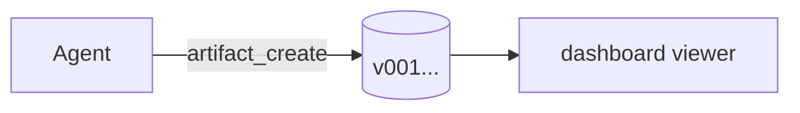
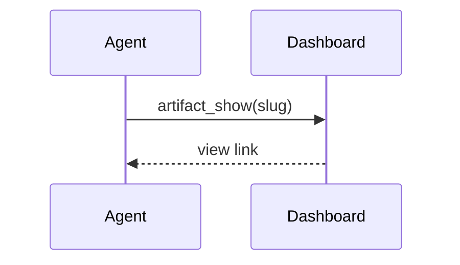

# Authoring markdown/mdx artifacts — complete reference

You (the agent) write a document. The artifact dashboard renders it in a
built-in viewer. You never generate HTML for documents, never ship a render
setup, never write files by hand — you call the tools (see SKILL.md) and the
viewer does the rest.

**Before writing mdx, call `artifact_capabilities`** (omp tool) or
`artifact capabilities --json` (CLI): same data as this page, always in sync
with the installed version.

## The contract (hard rules)

1. **Component props must be literals.** Strings `"…"`, numbers, booleans,
   and inline JSON arrays/objects. The viewer executes no code, so
   `data={sales}` (a variable reference) renders as a placeholder box, never
   a chart. **Inline your data**: `data={[{ name: "Q1", sales: 12 }]}`.
2. **Components sit on their own lines** (block-level, may be indented).
   Inline JSX in the middle of a paragraph is not a component call.
3. **No `import`/`export` statements** — they are useless here and hidden
   from the reader. Same for `{/* expression comments */}`.
4. **Unknown components never crash** — they render as a visible placeholder
   `⟨Tag⟩` so readers see something belongs there. Don't invent components:
   use the built-ins below or plain markdown.
5. **Children of `Callout`/`Stats` are markdown** — bold, lists, links, even
   nested components work inside them.
6. Lowercase HTML tags (`<details>`, `<b>`) pass through as normal markdown
   HTML; capitalized tags are components.

## Choosing the format

| Need | Format |
| --- | --- |
| Notes, reports, specs, any prose | `md` |
| Same + charts, KPIs, callouts, diagrams as components | `mdx` |
| Truly interactive / self-contained page | `html` (last resort) |

## Frontmatter (both md and mdx)

```yaml
---
title: Release Notes Q3        # sidebar label; fallback: first # heading
type: study                    # generic (default) | study | wireframe (sidebar badge)
---
```

## Built-in components

### `Chart` — real chart (rendered with recharts)

```mdx
<Chart
  type="bar"
  title="Revenue by quarter (k USD)"
  data={[
    { name: "Q1", mrr: 12.0, churn: 2.1 },
    { name: "Q2", mrr: 12.8, churn: 1.9 },
    { name: "Q3", mrr: 14.9, churn: 1.4 },
  ]}
  series={["mrr", "churn"]}
/>
```

| Prop | Required | Type | Default | Notes |
| --- | --- | --- | --- | --- |
| `data` | yes | array of objects | — | one object per point; one string key (x axis) + numeric keys |
| `type` | no | `"bar" \| "line" \| "area" \| "pie"` | `"bar"` | |
| `x` | no | string | `"name"` | which key is the category axis |
| `series` | no | array of strings | all numeric keys (max 4) | which keys to plot; pie uses the first |
| `title` | no | string | — | small caption above the chart |
| `height` | no | number | `240` | px, clamped to 160–480 |

- Charts are **static renders** (no hover tooltips) and follow the dashboard
  theme automatically.
- Pie: values come from `series[0]` (or the first numeric key), labels from `x`.

### `Stats` + `Stat` — KPI grid

```mdx
<Stats>
  <Stat value="14.9k" label="MRR" delta="+24%" />
  <Stat value="1.4%" label="Churn" delta="-0.5pp" />
  <Stat value="72" label="Sessions" />
</Stats>
```

| Component | Prop | Required | Notes |
| --- | --- | --- | --- |
| `Stat` | `value` | yes | main figure (string) |
| `Stat` | `label` | no | small uppercase caption |
| `Stat` | `delta` | no | starts with `+` → green, `-` → red |
| `Stats` | children | yes | the `<Stat />` cells; responsive grid |

### `Callout` — highlighted note

```mdx
<Callout type="warning" title="Props must be literals">
  `data={sales}` does **not** work — write `data={[{ name: "Q1", sales: 12 }]}`.
</Callout>
```

| Prop | Required | Notes |
| --- | --- | --- |
| `type` | no | `info` (default) \| `warning` \| `success` \| `danger` — picks color |
| `title` | no | bold heading |
| children | no | **markdown body** (bold, lists, links, code) |

## Diagrams — mermaid fences (md and mdx)

Any fenced block tagged `mermaid` renders as a diagram. No component, no props:

````mdx

````

Supported: flowchart, sequence, class, state, ER, gantt, pie, journey,
mindmap, gitGraph… (whatever the installed mermaid supports). Rendered
client-side; if scripts are unavailable the raw source stays visible.
**Prefer mermaid over ASCII diagrams** — always.

## Plain markdown you can rely on (GFM)

- Tables, task lists (`- [x]`), strikethrough, autolinks
- Fenced code with syntax highlighting (` ```ts `, ` ```py `…)
- Headings, lists, blockquotes, links, images (max-width constrained)
- The viewer applies dark/light theme — never hardcode colors in inline HTML

## Common mistakes

| You wrote | You'll see | Fix |
| --- | --- | --- |
| `data={sales}` | placeholder `⟨Chart /⟩` | inline the array literal |
| `<Chart />` mid-paragraph | literal text | own line, block-level |
| `disabled` (boolean shorthand) | placeholder | `disabled={true}` |
| `import Chart from …` | hidden line | built-ins need no imports |
| `<myWidget />` (lowercase) | inert HTML | capitalize or use built-ins |
| ASCII art diagram | ugly wall | mermaid fence |

## Copy-paste skeleton

```mdx
---
title: Q3 Report
type: study
---

# Q3 Report

One-paragraph TL;DR with **key numbers**.

<Stats>
  <Stat value="14.9k" label="MRR" delta="+24%" />
  <Stat value="1.4%" label="Churn" delta="-0.5pp" />
</Stats>

## Detail

<Chart
  type="line"
  title="Weekly active agents"
  data={[
    { week: "W1", sessions: 38 },
    { week: "W2", sessions: 44 },
    { week: "W3", sessions: 51 },
  ]}
  x="week"
/>



<Callout type="info" title="Next steps">
  Anything markdown works **in here** — [links](https://example.com), lists, `code`.
</Callout>

| Metric | Q2 | Q3 |
| --- | ---: | ---: |
| MRR | 12.0k | 14.9k |
```

Save it with the omp tools (never by hand):

```
artifact_create(slug="q3-report", title="Q3 Report", content=…, format="mdx")
```
