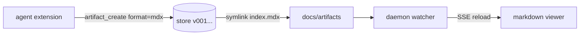
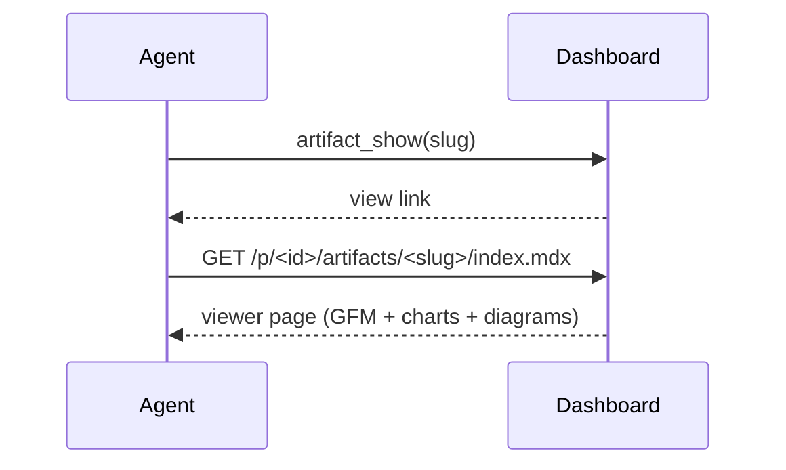
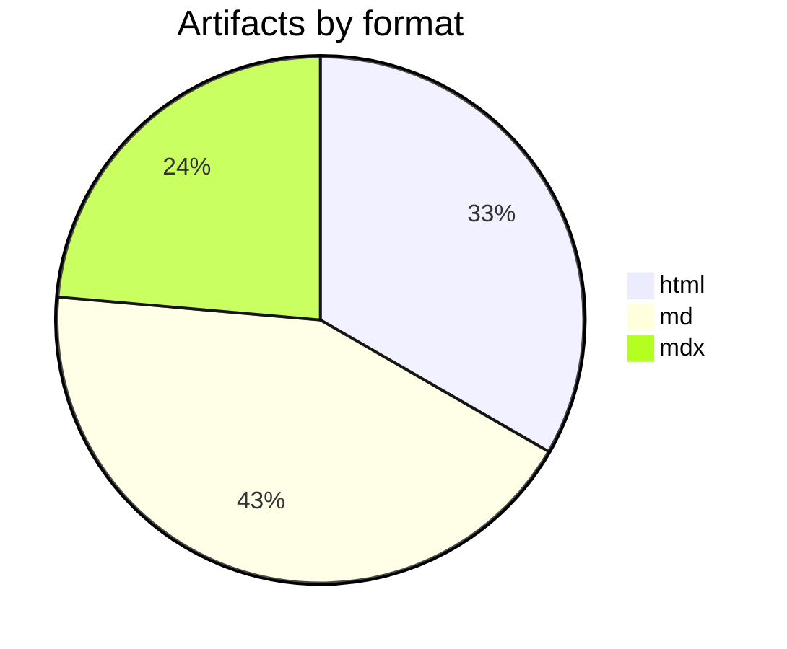

# MDX Guide

Everything you can put inside an `.mdx` artifact, rendered live by the
dashboard's built-in viewer. Save your document as
`docs/artifacts/<slug>/index.mdx` (or push it with `artifact_create` using
`format: "mdx"`) and it renders exactly like this page.

**The contract in one line:** props must be literals (strings, numbers,
booleans, JSON arrays/objects) — the viewer executes no code, so inline your
data instead of referencing variables.

<Callout type="info" title="Rule of thumb">
Documents, reports, notes → plain `.md`. Documents that need **charts,
KPIs, sections or declarative graphics** → `.mdx` with the components below.
</Callout>

<Callout type="warning" title="Relevance filter — apply before any visual">
Components are information tools, not decoration. **Default to prose.** A
diagram must show real structure (3+ interacting steps/actors, architecture,
states); a chart needs **real data — never invent numbers** to justify one.
One diagram per document, and if the text has to explain the visual, drop
the visual.
</Callout>

## Charts — `Chart` (rendered with recharts)

`type` is one of `bar` (default), `line`, `area` or `pie`. `data` is an array
of objects: one key is the `x` axis (default `"name"`), the numeric keys are
the series (or pass `series: ["key", ...]` to pick them).

<Chart
  type="bar"
  title="Revenue by quarter (k USD)"
  data={[
    { name: "Q1", mrr: 12.0, churn: 2.1 },
    { name: "Q2", mrr: 12.8, churn: 1.9 },
    { name: "Q3", mrr: 14.9, churn: 1.4 },
    { name: "Q4", mrr: 16.2, churn: 1.1 },
  ]}
  series={["mrr", "churn"]}
/>

Line charts for trends:

<Chart
  type="line"
  title="Weekly active agents"
  data={[
    { week: "W1", sessions: 38, agents: 12 },
    { week: "W2", sessions: 44, agents: 14 },
    { week: "W3", sessions: 51, agents: 17 },
    { week: "W4", sessions: 63, agents: 21 },
    { week: "W5", sessions: 72, agents: 26 },
  ]}
  x="week"
/>

Areas to emphasize volume:

<Chart
  type="area"
  title="Storage used (GB)"
  data={[
    { month: "Ene", store: 3.1 },
    { month: "Feb", store: 3.9 },
    { month: "Mar", store: 5.2 },
    { month: "Abr", store: 6.8 },
  ]}
  x="month"
/>

Pie for shares (the first numeric key is the value):

<Chart
  type="pie"
  title="Artifacts by format"
  data={[
    { format: "html", count: 24 },
    { format: "md", count: 31 },
    { format: "mdx", count: 17 },
  ]}
  x="format"
  height={260}
/>

Charts are **static server-side renders** (no hover tooltips) and follow the
dashboard theme automatically. Hover any chart for its **⤢ expand button**
to see it full-viewport.

## KPIs — `Stats` + `Stat`

`Stat` takes `value`, `label` and an optional `delta` (`+`/`-` prefix picks
the color). Wrap several in `Stats` for a responsive grid.

<Stats>
  <Stat value="14.9k" label="MRR" delta="+24%" />
  <Stat value="1.4%" label="Churn" delta="-0.5pp" />
  <Stat value="72" label="Sessions" delta="+38%" />
  <Stat value="17" label="Artifacts" delta="+6" />
</Stats>

## Callouts — `Callout`

`type` is one of `info`, `warning`, `success`, `danger`; `title` is optional
and children are **markdown** (bold, links, lists — everything works).

<Callout type="warning" title="Props must be literals">
`data={sales}` does **not** work — the viewer never evaluates code.
Write `data={[{ name: "Q1", sales: 12 }]}` instead.
</Callout>

<Callout type="success" title="Versioning still applies">
Every save through `artifact_create` / `artifact_update` creates a new
`v00N` and hot-reloads this preview.
</Callout>

<Callout type="danger">
Default type is `info`; unknown types fall back to it too.
</Callout>

## Sections for long documents — headings + `Section`

Every `##` / `###` heading gets an anchor id automatically (accents
stripped: `Qué es` → `#que-es`, hover any heading for its `#` link).
When a document has **3 or more headings**, the viewer adds a
**Secciones sidebar**: sticky index on desktop, stacked card on mobile,
with scroll-spy highlighting where you are. Everything you keep adding
with `##` shows up there — no configuration, just keep writing markdown
and readers can jump around the document.

For a highlighted block with its own card, use `Section` (its title is a
regular `h2`, so it joins the sidebar too; children are **markdown**):

<Section title="Qué es (y para quién)" subtitle="El vertical base de Avileo">
  Prose, lists, even nested components — everything works in here.

  - **Modo técnico:** `businessMode: "distributor"`.
  - **Firma:** "Vende. Cobra. Controla."
</Section>

```mdx
<Section title="Cierre de jornada" subtitle="Qué tiene que pasar en la operación">
  Prose, lists, even <Chart /> or <Svg /> inside.
</Section>
```

| Prop | Required | Notes |
| --- | --- | --- |
| `title` | yes | card heading; becomes the `#anchor` (accents stripped) |
| `id` | no | custom anchor, e.g. `id="cierre"` → `#cierre` |
| `subtitle` | no | muted line under the heading |
| children | no | **markdown body** |

Tips: short docs (fewer than 3 headings) keep the current single-column
look — the sidebar only appears when the document is long enough to need
it. Prefer `##` for sections, `###` for subsections; one `#` title per
document.

## Declarative SVG graphics — `Svg`

When a mermaid diagram is too much (or not the right shape), describe a
small vector graphic as **literal data** — no hand-written `<svg>`
markup, no code. You declare `shapes`, the viewer draws them:

<Svg
  title="Vende · Cobra · Controla"
  shapes={[
    { type: "box", x: 10, y: 50, w: 150, h: 70, label: "Vende", sub: "en ruta", color: "blue" },
    { type: "arrow", x1: 160, y1: 85, x2: 210, y2: 85 },
    { type: "box", x: 210, y: 50, w: 150, h: 70, label: "Cobra", sub: "por cliente", color: "green" },
    { type: "arrow", x1: 360, y1: 85, x2: 410, y2: 85 },
    { type: "box", x: 410, y: 50, w: 150, h: 70, label: "Controla", sub: "pulso del día", color: "purple" },
  ]}
/>

```mdx
<Svg
  title="Vende · Cobra · Controla"
  shapes={[
    { type: "box", x: 10, y: 50, w: 150, h: 70, label: "Vende", sub: "en ruta", color: "blue" },
    { type: "arrow", x1: 160, y1: 85, x2: 210, y2: 85 },
    { type: "box", x: 210, y: 50, w: 150, h: 70, label: "Cobra", sub: "por cliente", color: "green" },
    { type: "arrow", x1: 360, y1: 85, x2: 410, y2: 85 },
    { type: "box", x: 410, y: 50, w: 150, h: 70, label: "Controla", sub: "pulso del día", color: "purple" },
  ]}
/>
```

Shape reference (all props are literals — coordinates are canvas pixels):

| `type` | Coords | Extras |
| --- | --- | --- |
| `box` | `x`, `y`, `w`, `h` | `label?`, `sub?` (second line), `color?` |
| `circle` | `cx`, `cy`, `r` | `label?`, `color?` |
| `arrow` | `x1`, `y1`, `x2`, `y2` | `label?` (midpoint tag), `dashed?` |
| `line` | `x1`, `y1`, `x2`, `y2` | `label?`, `dashed?` (no arrowhead) |
| `text` | `x`, `y`, `text` | `size?` (9–28), `anchor?` (`middle` default, `start`, `end`) |

Canvas: `width?` (240–860, default 640), `height?` (120–520, default
220), `title?` caption. Colors: `blue` (default), `green`, `yellow`,
`red`, `purple`, `teal`, `gray`. Labels follow the dashboard theme
automatically; at most 40 shapes per graphic.

A second pattern — milestones joined by a dashed connector:

<Svg
  title="Jornada del vendedor"
  height={160}
  shapes={[
    { type: "circle", cx: 60, cy: 70, r: 30, label: "1", color: "blue" },
    { type: "line", x1: 90, y1: 70, x2: 170, y2: 70, dashed: true },
    { type: "circle", cx: 200, cy: 70, r: 30, label: "2", color: "green" },
    { type: "line", x1: 230, y1: 70, x2: 310, y2: 70, dashed: true },
    { type: "circle", cx: 340, cy: 70, r: 30, label: "3", color: "purple" },
    { type: "text", x: 60, y: 125, text: "entrega" },
    { type: "text", x: 200, y: 125, text: "cobra" },
    { type: "text", x: 340, y: 125, text: "cierra" },
  ]}
/>

Same relevance filter as charts: a graphic must show real structure from
the document — never invent content to justify one.

## Tables — plain GFM, no component needed

| Component | Props | Notes |
| --- | --- | --- |
| `Chart` | `type`, `data`, `series?`, `x?`, `title?`, `height?` | bar · line · area · pie |
| `Stats` | children | responsive grid wrapper |
| `Stat` | `value`, `label?`, `delta?` | one KPI cell |
| `Callout` | `type?`, `title?`, children | info · warning · success · danger |
| `Section` | `title`, `id?`, `subtitle?`, children | titled card, joins the Secciones index |
| `Svg` | `shapes`, `width?`, `height?`, `title?` | declarative boxes · circles · arrows · texts |

## Diagrams — mermaid fences

Any fenced block tagged `mermaid` renders as a diagram in the viewer
(flowchart, sequence, class, state, ER, gantt, pie, journey, …). No props, no
components — just the fence:





Pie for shares — labels **must be quoted**, values are numbers:



Diagrams render client-side from a bundle served by your own daemon — they
work offline and over Tailscale. If scripts are unavailable the raw source
stays visible instead of a blank box.

Every graphic on this page — charts, `Svg` figures and mermaid diagrams —
carries an **⤢ expand button** (top-right on hover): it opens a
full-viewport overlay where the vector scales up; ESC or a backdrop click
closes it.

Discover everything programmatically: `artifact capabilities --json`
(formats, components with props, mermaid, features) or open this guide with
`artifact guide`.

## Sibling files & sub-routes — the folder standard

An artifact is a **folder**, not a single file. Everything next to
`index.mdx` is first-class and referenceable by relative path:

```
docs/artifacts/un-artifact/
├── index.mdx        # entry (versioned via artifact_create)
├── asset.png        # 
├── logo.svg         #  or 
├── other.html       # browsable sub-route, or embed with <Webframe>
└── other.md         # [notes](other.md) → renders as a viewer sub-route
```

| Sibling | Referenced as | What the reader gets |
| --- | --- | --- |
| image/svg | `` | inline image |
| `.md` / `.mdx` | `[notes](other.md)` | viewer-rendered sub-route |
| `.html` | `<Webframe src="other.html" />` | browser-like embed below |
| any file | link | served with proper MIME |

Agents: attach bytes with the `artifact_asset` tool (name may be a subpath
like `shots/01.png`); or drop/symlink a folder into
`docs/artifacts/<slug>/` yourself — the daemon serves whatever it finds.

`Webframe` embeds a sibling page in a browser chrome (only
artifact-relative `src`, `height` 160-720):

<Webframe src="frame-demo.html" title="wireframe.html — live demo" height={340} />

## Everything else is Markdown + GFM

- Task lists: `- [x] done`, `- [ ] pending`
- Strikethrough: `~~old~~`, autolinks, footnotes-free simple prose
- Images: `` — max-width constrained

```tsx
// Fenced code is syntax-highlighted (ts, tsx, py, json, bash, ...)
import { Chart } from "built-in";

<Chart type="bar" data={[{ name: "Q1", v: 12 }]} series={["v"]} />
```

## What happens with anything else

Module-level `import`/`export` statements and `{/* expression comments */}`
are hidden. **Unknown components never disappear silently** — they render as
a visible placeholder so readers know something belongs there:

<SomeCustomWidget src="https://example.com/embed" />

If you need one of those to render for real, it has to join the built-in
registry (`src/server/mdx-components.ts`) — ask in the repo.
