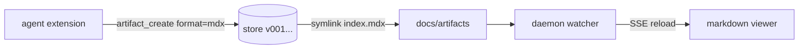
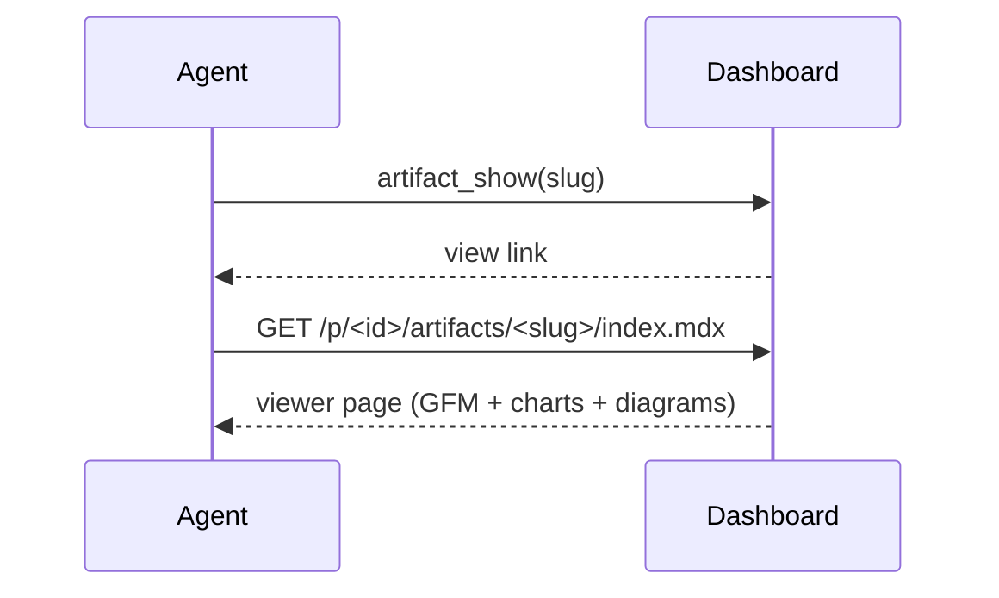

# MDX Guide

Everything you can put inside an `.mdx` artifact, rendered live by the
dashboard's built-in viewer. Save your document as
`docs/artifacts/<slug>/index.mdx` (or push it with `artifact_create` using
`format: "mdx"`) and it renders exactly like this page.

**The contract in one line:** props must be literals (strings, numbers,
booleans, JSON arrays/objects) — the viewer executes no code, so inline your
data instead of referencing variables.

<Callout type="info" title="Rule of thumb">
Documents, reports, notes → plain `.md`. Documents that need **charts,
KPIs or callouts** → `.mdx` with the components below.
</Callout>

<Callout type="warning" title="Relevance filter — apply before any visual">
Components are information tools, not decoration. **Default to prose.** A
diagram must show real structure (3+ interacting steps/actors, architecture,
states); a chart needs **real data — never invent numbers** to justify one.
One diagram per document, and if the text has to explain the visual, drop
the visual.
</Callout>

## Charts — `Chart` (rendered with recharts)

`type` is one of `bar` (default), `line`, `area` or `pie`. `data` is an array
of objects: one key is the `x` axis (default `"name"`), the numeric keys are
the series (or pass `series: ["key", ...]` to pick them).

<Chart
  type="bar"
  title="Revenue by quarter (k USD)"
  data={[
    { name: "Q1", mrr: 12.0, churn: 2.1 },
    { name: "Q2", mrr: 12.8, churn: 1.9 },
    { name: "Q3", mrr: 14.9, churn: 1.4 },
    { name: "Q4", mrr: 16.2, churn: 1.1 },
  ]}
  series={["mrr", "churn"]}
/>

Line charts for trends:

<Chart
  type="line"
  title="Weekly active agents"
  data={[
    { week: "W1", sessions: 38, agents: 12 },
    { week: "W2", sessions: 44, agents: 14 },
    { week: "W3", sessions: 51, agents: 17 },
    { week: "W4", sessions: 63, agents: 21 },
    { week: "W5", sessions: 72, agents: 26 },
  ]}
  x="week"
/>

Areas to emphasize volume:

<Chart
  type="area"
  title="Storage used (GB)"
  data={[
    { month: "Ene", store: 3.1 },
    { month: "Feb", store: 3.9 },
    { month: "Mar", store: 5.2 },
    { month: "Abr", store: 6.8 },
  ]}
  x="month"
/>

Pie for shares (the first numeric key is the value):

<Chart
  type="pie"
  title="Artifacts by format"
  data={[
    { format: "html", count: 24 },
    { format: "md", count: 31 },
    { format: "mdx", count: 17 },
  ]}
  x="format"
  height={260}
/>

Charts are **static server-side renders** (no hover tooltips) and follow the
dashboard theme automatically.

## KPIs — `Stats` + `Stat`

`Stat` takes `value`, `label` and an optional `delta` (`+`/`-` prefix picks
the color). Wrap several in `Stats` for a responsive grid.

<Stats>
  <Stat value="14.9k" label="MRR" delta="+24%" />
  <Stat value="1.4%" label="Churn" delta="-0.5pp" />
  <Stat value="72" label="Sessions" delta="+38%" />
  <Stat value="17" label="Artifacts" delta="+6" />
</Stats>

## Callouts — `Callout`

`type` is one of `info`, `warning`, `success`, `danger`; `title` is optional
and children are **markdown** (bold, links, lists — everything works).

<Callout type="warning" title="Props must be literals">
`data={sales}` does **not** work — the viewer never evaluates code.
Write `data={[{ name: "Q1", sales: 12 }]}` instead.
</Callout>

<Callout type="success" title="Versioning still applies">
Every save through `artifact_create` / `artifact_update` creates a new
`v00N` and hot-reloads this preview.
</Callout>

<Callout type="danger">
Default type is `info`; unknown types fall back to it too.
</Callout>

## Tables — plain GFM, no component needed

| Component | Props | Notes |
| --- | --- | --- |
| `Chart` | `type`, `data`, `series?`, `x?`, `title?`, `height?` | bar · line · area · pie |
| `Stats` | children | responsive grid wrapper |
| `Stat` | `value`, `label?`, `delta?` | one KPI cell |
| `Callout` | `type?`, `title?`, children | info · warning · success · danger |

## Diagrams — mermaid fences

Any fenced block tagged `mermaid` renders as a diagram in the viewer
(flowchart, sequence, class, state, ER, gantt, pie, journey, …). No props, no
components — just the fence:





Diagrams render client-side from a bundle served by your own daemon — they
work offline and over Tailscale. If scripts are unavailable the raw source
stays visible instead of a blank box.

Discover everything programmatically: `artifact capabilities --json`
(formats, components with props, mermaid, features) or open this guide with
`artifact guide`.

## Everything else is Markdown + GFM

- Task lists: `- [x] done`, `- [ ] pending`
- Strikethrough: `~~old~~`, autolinks, footnotes-free simple prose
- Images: `` — max-width constrained

```tsx
// Fenced code is syntax-highlighted (ts, tsx, py, json, bash, ...)
import { Chart } from "built-in";

<Chart type="bar" data={[{ name: "Q1", v: 12 }]} series={["v"]} />
```

## What happens with anything else

Module-level `import`/`export` statements and `{/* expression comments */}`
are hidden. **Unknown components never disappear silently** — they render as
a visible placeholder so readers know something belongs there:

<SomeCustomWidget src="https://example.com/embed" />

If you need one of those to render for real, it has to join the built-in
registry (`src/server/mdx-components.ts`) — ask in the repo.
